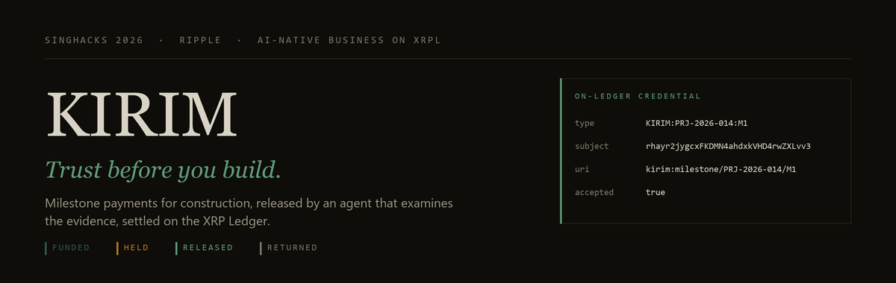

<div align="center">



<br>

**Trust before you build.**

Milestone payments for construction, released by an agent that examines the evidence, settled on the XRP Ledger.

<br>

[](https://testnet.xrpl.org)
[](https://xrpl-x402.t54.ai/docs)
[](https://github.com/XRPLF/XRPL-Standards)
[](https://xrpl.org/docs/concepts/payment-types/escrow)
[](https://tryrlusd.com)
[](https://mpp.dev)
[](https://ripple.com/insights/xrpl-ai-starter-kit/)
<br>
[](https://nodejs.org)
[](#run-it)
[](docs/transactions.md)
[](https://github.com/Singhacks-2026/ripple)

<br>

[Problem](#the-problem) · [How it works](#how-it-works) · [Run it](#run-it) · [Architecture](#architecture) · [What the agent checks](#what-the-agent-actually-checks) · [Proof](docs/transactions.md)

</div>

<br>

---

## The problem

A homeowner pays a large deposit before meaningful work exists. From that moment the contractor holds the money and the client holds the risk.

The reliable contractor has the mirror problem. They finish the work, then wait — for a client who is slow, unhappy, or gone. Singapore has a Security of Payment Act precisely because this is endemic.

| | Today | With Kirim |
|---|---|---|
| Money at the start | 30–50% deposit, unsecured | Escrowed per milestone, nobody can spend it |
| Basis for payment | A promise, then an invoice | Evidence reconciled against the agreed scope |
| Time to payment | 30–60 days | ~4 seconds |
| If nothing is delivered | Dispute, lawyer, or write-off | `CancelAfter` returns the funds automatically |
| Contractor's reputation | A folder of photos and hearsay | Credentials on their own XRPL account |

## How it works

```
milestone agreed → client funds escrow → contractor submits evidence
      → agent buys its checks over x402 → evidence examined
      → released in ~4s, or held with the discrepancy named
      → credential written to the contractor's ledger account
```

The money for each milestone is locked on the XRP Ledger under a **PREIMAGE-SHA-256 crypto-condition** before work starts. Only the holder of the fulfillment can release it, and Kirim holds it until the evidence conforms. If nothing is ever presented, `CancelAfter` returns the money to the client with no dispute process.

**Remove the agent** and you need a site visit for every payment, which is why milestone escrow does not exist at renovation scale today. **Remove autonomous payment** and the escrow is just an invoice again.

## Run it

```bash
npm install
cp .env.example .env

npm run setup             # four funded XRPL testnet wallets → wallets.json
npm run escrow:smoke      # THE GATE — escrow create, finish, cancel-on-timeout
npm run credential:smoke  # XLS-70 CredentialCreate + CredentialAccept

npm run dev               # ledger + market + console  →  http://localhost:4000
npm run milestone all     # or: npm run milestone M2
```

`npm run escrow:smoke` is load-bearing. If it does not pass, nothing above it can be trusted.

### The six scenarios

| Milestone | Amount | What it demonstrates |
|---|---|---|
| `M1` Demolition | US$10,000 | Evidence conforms → **released autonomously**, credential issued |
| `M2` Plumbing | US$10,000 | A photo taken **2.3 km off site** and an unverifiable delivery note → **flagged** |
| `M3` Electrical | US$10,000 | One photo, no delivery notes, no inspection result → **more information needed** |
| `M4` Tiling | US$10,000 | Inspection at 72% with a critical defect, plus a **recycled photograph** → **flagged** |
| `M5` Variation order | US$18,000 | Evidence conforms but the amount is **above the ceiling** → the client is asked |
| `M6` Final completion | US$10,000 | Nothing ever submitted → escrow **times out and the money returns** |

The interesting ones are `M2`, `M3` and `M6`. A payment that correctly does *not* happen is what makes an autonomous payment system credible.

`M3` matters for a different reason: *"you did not send enough"* and *"what you sent does not add up"* are different messages, and only the second should ever mark a contractor's record.

A full transcript of one run is in [docs/demo-run.txt](docs/demo-run.txt).

## Architecture

Full diagram in [docs/architecture.md](docs/architecture.md). One rule holds the design together:

> **The agent may request a payment. Only the ledger service may send one.**

```
apps/console            live decision log over server-sent events
services/orchestrator   the agent — discover, buy, examine, decide  (holds NO seed)
services/ledger         THE ONLY SEED HOLDER — escrow, credentials, spend ceilings
services/market         MPP-gated evidence providers (simulated supply, real payments)
packages/works          milestone schema, discrepancy rules, track record
packages/trade          the cross-border trade vertical, on the same engine
packages/mpp            Machine Payments Protocol — seller gate, buyer, credit
```

The orchestrator has no wallet and never imports `xrpl`. It asks; the ledger service enforces ceilings from `.env`, signs, and returns a hash. A refusal comes back as a logged decision with a reason, never a silent no-op.

**The same engine runs a second vertical.** `npm run trade PO-2026-0418` settles a cross-border trade document credit — same escrow, same MPP payment path, different evidence rules. Two markets, one machine. See [docs/README-trade-vertical.md](docs/README-trade-vertical.md).

**One payment implementation.** Kirim started with a hand-rolled HTTP 402 flow. It was replaced by `xrpl-mpp-sdk`, and the hand-rolled package was deleted rather than left beside it — a reviewer opening this repo finds one way payments happen, and it is the ecosystem's.

## What the agent actually checks

A photograph on its own cannot be examined. A photograph with an EXIF timestamp and a GPS fix can. Kirim does not claim to verify construction — it reconciles submitted evidence against the agreed scope and says plainly where the two disagree.

| Code | Severity | Check |
|---|---|---|
| `PHOTO-GEO` | blocking | Photograph taken outside the site boundary |
| `PHOTO-TIME` | blocking | Timestamp precedes the milestone start, or postdates the submission |
| `PHOTO-REUSED` | blocking | Byte-identical to a photograph from an earlier milestone |
| `PHOTO-TAMPERED` | blocking | Forensics found re-encoding after capture |
| `MATERIALS-SHORT` | blocking | Delivered quantity below the bill of quantities |
| `DELIVERY-UNVERIFIED` | blocking | Delivery note absent from the supplier's own records |
| `INSPECT-INCOMPLETE` | blocking | Independent inspection below the release threshold |
| `DEFECT-CRITICAL` | blocking | Critical defect open at inspection |
| `PERMIT-MISSING` | blocking | Required permit reference not provided |
| `SEQ-INCOMPLETE` | blocking | A milestone this one depends on has not been released |
| `EVIDENCE-THIN` | missing | Fewer photographs than the milestone requires |
| `INSPECTION-NORESULT` | missing | The inspection returned no completion figure |
| `LATE` | advisory | Submitted after the agreed date — recorded, not blocking |

The rules are deterministic and live in [`packages/works/src/examine.mjs`](packages/works/src/examine.mjs). A model writes the advice a client and contractor read; it never overturns a finding.

## Trust, governance and controls

| Consideration | How Kirim answers it |
|---|---|
| **Transparency** | Every step appends to a decision log with a reason; the console renders it live |
| **Authorisation** | Autonomous below `HUMAN_APPROVAL_ABOVE_USD`, asks above it — a threshold, not an approval queue |
| **Spending controls** | Per-call, per-milestone and per-run ceilings, enforced in the only process that can sign |
| **Security** | The agent never holds a seed. `wallets.json` is gitignored. Testnet only. |
| **Traceability** | Every ledger write carries a `Memo` bound to the milestone and a `SourceTag` for the agent |
| **Failure handling** | Discrepancy → funds held. Nothing presented → escrow cancels itself. Ledger error → the run stops loudly rather than narrating a settlement that never happened. |
| **Safeguards** | Providers verify payment **on-ledger** before serving a byte; the escrow condition means Kirim cannot pay for work that was never evidenced |

The challenge brief names "requiring humans to approve each agent action" as an anti-pattern. A value ceiling is a safeguard, not an approval queue: small milestones settle themselves, large ones ask.

## XRPL AI Starter Kit

The Starter Kit is used, not cited.

| Piece | How it is used here |
|---|---|
| **XRPL Agent Wallet skill** | `.claude/skills/xrpl-skills/xrpl-agent-wallet/` — the signing discipline this project follows: the seed never enters a transcript, one process owns signing, `submitAndWait` always, never bare `submit`. |
| **XRPL Payments skill** | `.claude/skills/xrpl-skills/xrpl-payments/` — transaction construction, memos on every agent transaction, and the simulate-before-submit pattern. |
| **XRPL Docs MCP server** | `.mcp.json` — Context7 (`context7.com/websites/xrpl`) exposes the full XRPL documentation as tool-callable context. |
| **`SourceTag` 20260530** | The kit's default, applied to every transaction Kirim signs, so the whole run is attributable on-chain. Verified on a live `EscrowCreate`. |

Two of those changed the code rather than the README:

**Simulate before signing.** The Payments skill prescribes a dry run before
spending a fee. Kirim now simulates every transaction and refuses to sign one
that would fail:

```
$ curl -X POST /escrow/create -d '{"amount":"999999999.00", ...}'
{"detail":"EscrowCreate would fail: tecUNFUNDED (simulated, nothing signed)"}
```

No fee charged, no ledger state touched. Both of the failures that cost this
build the most time — `tecUNFUNDED` on an over-large escrow and
`tecNO_PERMISSION` on a racing `FinishAfter` — would have surfaced here, before
a signature.

**The kit's SourceTag.** `AGENT_SOURCE_TAG` now defaults to the Starter Kit's
`20260530` rather than a number we invented, and `0` is respected as "suppress
tagging" rather than treated as absent.

## Claw Credit — written, gated, and honest about why

Agent credit is the right idea for this product. Today Sarah's wallet must hold
XRP before her agent can buy a thirty-cent inspection; with a credit line it
does not, and the checks are settled and repaid later.

The integration is written against the documented API and sits ahead of MPP in
the ledger service's `/buy`: when credit is available it is used, otherwise the
purchase settles from our own wallet. It is **not live**, and `npm run
credit:status` says exactly why rather than pretending:

```
$ curl localhost:4010/credit
{
  "available": false,
  "blockers": [
    "CLAW_CREDIT_ENABLED is not 1 — credit is off by default.",
    "No credentials at ~/.openclaw/agents/default/agent/clawcredit.json and no
     CLAW_INVITE_CODE to register with. Claw Credit registration is invite-only."
  ]
}
```

Four gates, in order of how hard they are to pass:

1. **Registration is invite-only.** `credit.register({ inviteCode })` — we have no code.
2. **It expects an OpenClaw workspace**, and reads credentials from `~/.openclaw/agents/<agent>/agent/clawcredit.json`.
3. **Registration does not grant credit.** A new agent enters a "pre-qualification monitoring phase" that needs a `HEARTBEAT.md` check and time to elapse.
4. **There is no sandbox.** The published 52KB skill mentions Base/USDC, Solana/USDC and XRPL/RLUSD, and never a testnet — so the path is mainnet-shaped and a testnet prototype cannot exercise it even with an invite.

The skill itself is vendored at `.claude/skills/clawcredit/SKILL.md` and the SDK
is an optional dependency. When an invite code arrives this goes live by setting
one environment variable; nothing else in Kirim changes, because the agent asks
the ledger service to buy a URL either way.

## Client authorisation is a signature, not a flag

Above `HUMAN_APPROVAL_ABOVE_USD` the agent finishes its work and stops. The
release then needs the client, and "the client approved" means a signature on
the ledger from their own wallet — not a boolean in a request body.

The client sends an ordinary XRPL Payment to Kirim carrying a memo naming the
milestone. **Crossmark** and **GemWallet** are wired into the console directly;
any other wallet — Xaman, a hardware wallet, a hand-built transaction — produces
the same authorisation, so the demo does not depend on one extension being
installed. `npm run authorise M5` does it from the command line.

Kirim then verifies it on-ledger before anything moves. Measured against a real
authorisation:

| Attempt | Result |
|---|---|
| The real authorisation | accepted |
| Replayed against a different milestone | refused — *does not name this milestone* |
| Claimed to come from the contractor | refused — *signed by the wrong account* |
| Addressed to another account | refused — *not addressed to Kirim* |
| A hash that does not exist | refused — *not on the ledger* |

## The track record

Every released milestone issues an **XLS-70 Credential** to the contractor's own XRPL account, which they accept. It is keyed `KIRIM:<project>:<milestone>`, so it cannot be double-counted, and any future client can verify it without asking Kirim anything.

```
type      KIRIM:PRJ-2026-014:M1
subject   rhayr2jygcxFKDMN4ahdxkVHD4rwZXLvv3
uri       kirim:milestone/PRJ-2026-014/M1/demolition-and-disposal?onTime=1
accepted  true
```

We do not claim a credential makes a contractor trustworthy. It makes their history visible.

## What is real and what is simulated

**Real:** every XRPL transaction. Escrow create, finish against a crypto-condition, cancel on timeout, every x402 payment, and every credential. Hashes are in [docs/transactions.md](docs/transactions.md) and link to the testnet explorer.

**Simulated:** the contractor, the photographs, the carrier and supplier registries, and the site inspector — all fixtures under `fixtures/`. No Singapore renovation firm has an x402 endpoint this weekend.

The line matters: simulated supply is normal, a simulated payment would not be.

## Commercial model — charged, not claimed

Kirim takes **0.8% of each released milestone**, and it is a real second leg on
the ledger rather than a line in this table. On a released US$10,000 milestone
the decision log reads:

```
REVENUE  charged
         Kirim charged US$80.00 — 0.8% of the milestone, taken at the moment of
         release. An escrow agent charges 3–5% and takes days.
         https://testnet.xrpl.org/transactions/38B69E5464E4B1…
```

| | Cost | Time |
|---|---|---|
| Escrow agent today | 3–5% | days |
| Kirim | **0.8%** | ~4 seconds |
| Evidence checks bought per milestone | US$0.48–0.73 | seconds |
| On a S$50,000 renovation | ~S$400 total | per milestone |

`PLATFORM_FEE_BPS` sets it; `0` turns it off. A fee that cannot be collected
never unwinds a release that has already happened — it is reported as
uncollected and the money stays where the evidence said it should.

The evidence checks are the part that could not exist before: an independent
inspection at thirty cents, priced per milestone, against a site visit that
costs a day.

## The agent plans, then buys

It does not run a fixed pipeline. It reads the milestone's own terms — how many
photographs were agreed, whether materials were scheduled, what completion
threshold was set — works out what still has to be *established* given what the
contractor actually presented, and decides what to buy within the budget.

On a milestone with no delivery notes:

> 2 check(s) to buy for US$0.38 of a US$5.00 budget … **Skipped:
> materials-delivered — no delivery notes were presented, so there is nothing to
> verify against the registry.**

The model proposes the plan; `packages/works/src/plan.mjs` validates it before a
cent is committed. It may not invent a provider, exceed the budget, or drop a
requirement the release rules will block on — each correction is logged rather
than hidden. One decision is deliberately **not** the model's: where the
deadline settles which inspector to buy, the deadline settles it, and a
differing suggestion is recorded as considered rather than acted on. A small
model should not get to spend more of the client's money against a rule that
crisp.

## The client sets the terms, not the operator

Sarah's own preferences live on the project, and the agent reads them:

```json
"preferences": {
  "autoReleaseCeilingUsd": 12000,
  "evidenceBudgetUsd": 5.00,
  "leaning": "cost"
}
```

> 3 check(s) to buy for US$0.48 of **Sarah Lim's US$5.00 evidence budget** …
> This milestone is inside its agreed date and **Sarah Lim leans to cost**, so the
> slower survey costs nothing and the difference stays with them.

A client may be **stricter** than Kirim's platform ceiling and never looser — the
ledger service enforces the tighter of the two, so a preference cannot buy away
a safeguard.

## A provider going down does not stop a milestone

Providers publish availability and a reliability score at `/v1/health`, and the
agent checks before it plans. With the express inspector taken down
(`MARKET_DOWN=site-inspection-express`) on a milestone that would otherwise
require it:

```
DISCOVERY  unavailable
           Independent site inspection (express) is not accepting requests.
           The plan routes around it.

PLANNING   corrected
           site-inspection-express is unavailable; bought site-inspection
           instead so the milestone is not held up by a provider outage.
```

An unavailable provider returns `503` and charges nothing, so the failure
happens before payment rather than after it. If no provider can establish a
mandatory requirement, the milestone is held rather than released on thinner
evidence.

## The agent compares before it buys

Two providers sell the same inspection — US$0.30 in 48 hours, or US$0.55 within
the hour — and the agent chooses on the milestone's own deadline pressure rather
than always taking the cheapest.

Inside the agreed date:

> Two providers sell this inspection: … The milestone is inside its agreed date,
> so the wait costs nothing. **Taking the cheaper survey and keeping US$0.25.**

Past the agreed date:

> … This milestone was due 2026-10-06 and the submission is 1 day(s) past it, so
> the extra US$0.25 buys back 47 hours. **Taking the express survey.**

Same evidence, different purchase, and the reason is on the record either way.

## Every milestone ends with what it cost

```
OUTCOME  complete
         Demolition and disposal settled in 47s. Evidence cost US$0.48 and Kirim
         charged US$80.00. The same assurance conventionally means a site visit
         and an escrow agent at 3–5% — days, not seconds, and roughly US$400.00
         on this milestone. ABC Renovation Pte Ltd was paid on presentation
         rather than on 30–60 day terms.
```

Measured from the run, not asserted in a table: elapsed seconds, evidence spend,
fee charged, and the human baseline it replaced.

## Settlement currency

Kirim settles in **RLUSD**. `.env` points at the testnet issuer `rQhWct2fv4Vc4KRjRgMrxa8xPN9Zx9iLKV` (`RLUSD_XRPL_ISSUER_TESTNET` in [t54-labs/rlusd-cli](https://github.com/t54-labs/rlusd-cli) — it is not documented in the challenge materials or on the faucet page), and `npm run setup` places trustlines on all four wallets.

Claiming the RLUSD itself is a browser step at [tryrlusd.com](https://tryrlusd.com) — there is no API, and the official RLUSD CLI defers to the same page. Until the client wallet holds RLUSD, set `SETTLEMENT=XRP` and the whole flow runs identically.

**Testnet scaling.** The RLUSD faucet allows 10 RLUSD per account per 24 hours and the XRP faucet caps a wallet at 100 XRP, so a US$10,000 milestone cannot settle at par. The principal is divided by `SETTLEMENT_DIVISOR` (default 5000) before it touches the ledger, and **every response carrying a scaled amount says so**. Operating spend — the x402 calls, all sub-dollar — is never scaled, so the amount each provider verifies on-ledger is exactly the price it quoted. `SETTLEMENT_DIVISOR=1` settles at par on a funded account.

## Amendment status, checked on testnet

| Amendment | Status | Used by Kirim |
|---|---|---|
| `Credentials` (XLS-70) | enabled | the track record |
| `TokenEscrow` | enabled | RLUSD escrow |
| `PermissionedDomains` | enabled | — |
| `PermissionedDEX` | enabled | — |
| `MPTokensV1` (XLS-33) | enabled | — |
| `Batch` | not in the testnet feature list | — |

## The model's role

Deliberately narrow. The rules in `packages/works` decide whether money moves; a
model never gets a vote. What it writes is the *advice* — the milestone review
note a homeowner and a contractor actually read.

Any one of these enables it, tried in that order:

```bash
ANTHROPIC_API_KEY=sk-ant-...                                    # Claude
OPENAI_API_KEY=sk-...                                           # OpenAI
OPENAI_API_KEY=gsk_...  OPENAI_BASE_URL=https://api.groq.com/openai/v1
OPENAI_API_KEY=...      OPENAI_BASE_URL=https://generativelanguage.googleapis.com/v1beta/openai
OPENAI_API_KEY=ollama   OPENAI_BASE_URL=http://localhost:11434/v1   # local, free
```

`KIRIM_MODEL` overrides the model for whichever provider is in use, and
`GET /api/reasoner` reports which one is live rather than leaving you to guess.

The workload is small — roughly 400 input and 120 output tokens per note, about
a dozen notes for a full six-milestone run — so this costs fractions of a cent
on any provider, and runs free on Groq, Gemini's free tier, or a local Ollama.

**Without a key it still runs end to end** on composed text. That is not a
placeholder, it is the demo's safety net: venue wifi fails and keys hit rate
limits, and a review note that cannot be written must never stop a payment the
rules have already decided.

## Builder feedback

The challenge feedback hook is installed in `hook/` and registered project-scoped in `.claude/settings.json`. Findings submitted from this build include the undocumented RLUSD testnet issuer, the faucet's lack of an HTTP endpoint, and `EscrowCreate` returning `tecNO_PERMISSION` when `FinishAfter` is only seconds ahead of the next ledger close.

## Ports

`4000` console · `4010` ledger · `4020` market. If `npm run dev` reports `EADDRINUSE`, a previous run's children survived — kill whatever is listening on those ports first.

---

<div align="center">
<sub><b>KIRIM</b> · Less blind trust. More visible proof.</sub>
</div>
